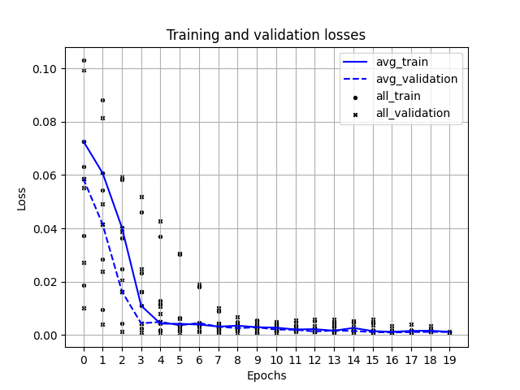
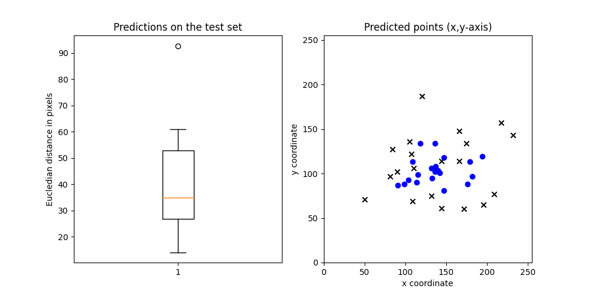

# GALIROOT

DTU special project under the EU project [GALIRUMI](https://galirumi-project.eu/news/new1). Small sneak-peak to our fun field trips:


___

## Setup

The dependecies of the repositories can be installed by the following:

`pip install -r requirements.txt`

The images and annotations can be found under *data.zip*. The following folder structure is advised:

```
config
└──augmentations
    └──example.json
    └──resnet18.json
└──example.json
└──resnet18_4.json
data
└──train
└──test
    └──ann
    └──img
    └──depth
models
└──checkpoint_name
    └──checkpoint_name.pt               -> saved model state
    └──loss_checkpoint_name.json        -> losses and configurations for the model
    └──loss_graph_checkpoint_name.png   -> kfold training and validation losses
    └──inf_checkpoint_name.png          -> inference on 20 test images 
    └──box_checkpoint_name.png          -> predictions and their offsets

```
___

## Usage

Logging and online visualization happens through the [Weights and Biases](https://wandb.ai/site), for which you need an account.

The script requires a configuration file defining the hyperparamters for the model and the I/O folders.

`python3 full_pipeline.py -c ~\config\example.json`

The inference (plotting and trying the model on the test images) is integrated in the pipeline, but can be run separately. [^1]

`python3 inference.py -c ~\config\example.json`

The outputs of these scripts will be saved under the model folder.

___

### Loss graph

Loss graph for kfold cross-validation. Lines represent the model saved, which means training and validation losses of the fold closest to the average of all folds. The $x$ are all validation and the $o$ are all training datapoints. 



### Predictions

The box plot showcases the offset of 20 predictions compared to the fround truth (pixel-wise Eucledian distance) on the test set. The ground truth points are marked by $x$ and the predictions by $o$ on the scatter plot. The $x$ and $y$ axes are represented also in pixel coordinates.



### Inference

The predictions (blue) and ground truth (red) of the stem labels plotted onto the 20 images of the test set. The border of the plot is red if the offset is over 40 pixels.


[^1]: still dealing with some tensor conversion issues